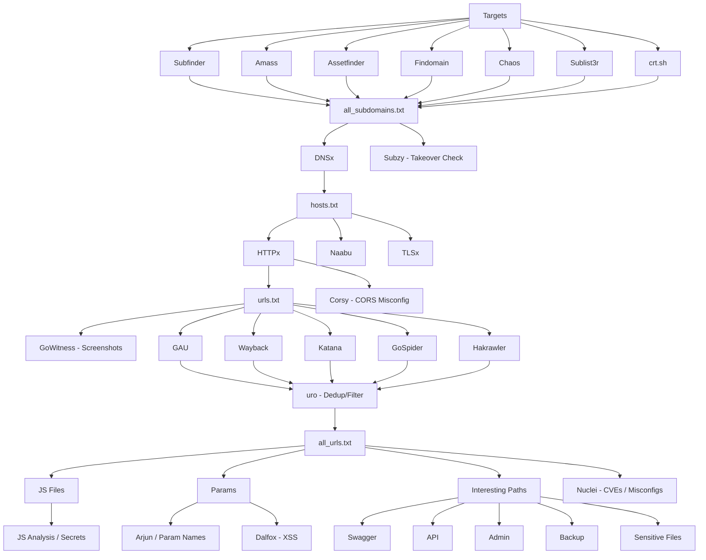

# Recon Pipeline

A step-by-step bug bounty recon workflow: subdomain enumeration → resolve/probe → screenshots/takeover checks → crawl → JS/API/params → fuzzing → vulnerability scanning → secrets.

## Pipeline Overview



---

## Phase 1 — Subdomain Enumeration

Input: `targets.txt` (one domain per line)

```bash
subfinder -dL targets.txt -all -recursive -o subfinder.txt
amass enum -passive -df targets.txt -o amass.txt

mkdir -p sublist3r
while read -r domain; do
    timeout 120s sublist3r -d "$domain" \
        -o "sublist3r/sublist3r_${domain//./_}.txt" 2>/dev/null
done < targets.txt
cat sublist3r/sublist3r_*.txt 2>/dev/null | sort -u > sublist3r/sublist3r.txt

# assetfinder takes one domain at a time, not a file list
> assetfinder.txt
while read -r domain; do
    assetfinder --subs-only "$domain" >> assetfinder.txt
done < targets.txt

findomain -f targets.txt -u findomain.txt
chaos -dL targets.txt -o chaos.txt

> crt.txt
while read -r domain; do
    curl -s "https://crt.sh/?q=%25.$domain&output=json" | jq -r '.[].name_value'
done < targets.txt | sed 's/\*\.//g' | sort -u > crt.txt
```

**Merge:**
```bash
cat subfinder.txt amass.txt assetfinder.txt findomain.txt chaos.txt \
    sublist3r/sublist3r.txt crt.txt 2>/dev/null | sort -u > all_subdomains.txt
```

## Phase 2 — Resolve, Probe & Takeover Check

```bash
dnsx -l all_subdomains.txt -resp -a -aaaa -cname -threads 25 -retry 5 -o resolved.txt
awk '{print $1}' resolved.txt | sort -u > hosts.txt
```

```bash
httpx -l hosts.txt -title -tech-detect -status-code -content-length \
    -web-server -follow-redirects -o alive.txt
awk '{print $1}' alive.txt > urls.txt

naabu -l hosts.txt -top-ports 1000 -rate 2000 -o ports.txt

tlsx -l hosts.txt -san -cn -tls-version -jarm -o tls.txt
```

**Subdomain takeover check** — flags dangling CNAMEs pointing to unclaimed services (S3, GitHub Pages, Heroku, etc.):
```bash
subzy run --targets all_subdomains.txt --hide_fails --verify_ssl -o subzy.txt
```

**Screenshots** — quick visual triage of what's alive:
```bash
gowitness scan file -f urls.txt --write-db -s ./screenshots
```

## Phase 3 — Crawling

```bash
gau --threads 50 < urls.txt > gau.txt
cat urls.txt | waybackurls > wayback.txt
katana -list urls.txt -d 8 -jc -js-crawl -jsluice -o katana.txt

mkdir -p gospider
gospider -S urls.txt -d 3 -c 20 -o gospider/
grep -rhoE 'https?://[^[:space:]"<>]+' gospider/ | sort -u > gospider_urls.txt

cat urls.txt | hakrawler -d 4 -u -t 20 > hakrawler.txt
```

**Merge + dedup:**
```bash
cat gau.txt wayback.txt katana.txt hakrawler.txt gospider_urls.txt 2>/dev/null \
    | sort -u > all_urls_raw.txt

# uro strips redundant/near-duplicate URLs (same path, different param values)
cat all_urls_raw.txt | uro > all_urls.txt
```

## Phase 4 — JS, Params & Interesting Paths

**JS files:**
```bash
grep "\.js" all_urls.txt | sort -u > js.txt

> js_raw.txt
cat js.txt | xargs -P20 -I{} curl -ks "{}" >> js_raw.txt

grep -aEo "/(api|v1|v2|graphql|internal|admin)/[A-Za-z0-9/_-]+" js_raw.txt \
    | sort -u > api_endpoints.txt

grep -Ei "graphql|gql" all_urls.txt js_raw.txt | sort -u > graphql.txt
```

**Params:**
```bash
grep "=" all_urls.txt > params.txt
cat params.txt | unfurl keys | sort -u > param_names.txt

arjun -i urls.txt -oT arjun.txt
```

**Interesting paths:**
```bash
grep -Ei "swagger|openapi|swagger.json|api-docs" all_urls.txt > swagger.txt

grep -Ei "api|admin|internal|gateway|oauth|auth|graphql|upload|dev|stage|beta" \
    all_subdomains.txt > juicy.txt

grep -Ei "\.env|\.git|backup|config|swagger|openapi|\.sql|\.zip|\.bak" all_urls.txt \
    > sensitive.txt

grep -Ei '\.(txt|log|cache|secret|db|backup|yml|yaml|json|gz|rar|zip|config)$' \
    all_urls.txt > hidden_files.txt
```

## Phase 5 — Fuzzing

Replace `TARGET_API` / `TARGET_HOST` with your actual target before running.

```bash
ffuf -u "https://TARGET_API/FUZZ" \
    -w /usr/share/seclists/Discovery/Web-Content/raft-medium-directories.txt \
    -mc 200,204,301,302,307,401,403 -fc 404 -o ffuf-api.txt

feroxbuster -u "https://TARGET_HOST/" \
    -w /usr/share/seclists/Discovery/Web-Content/raft-medium-directories.txt \
    -x js,json,xml,txt,bak,old,backup,conf,config,env,log,yml,yaml,ini,zip \
    -s 200,204,301,302,307,308,401,403 -t 10 \
    --user-agent 'Mozilla/5.0' -o ferox.txt
```

## Phase 6 — Vulnerability Scanning

**Nuclei** — template-based scan for known CVEs, exposures and misconfigs across all live hosts:
```bash
nuclei -l urls.txt -tags cve,exposure,misconfig,takeover -severity medium,high,critical -o nuclei.txt
```

**Dalfox** — reflected/DOM XSS on discovered parameters:
```bash
dalfox file params.txt -o dalfox.txt
```

**Corsy** — CORS misconfiguration check:
```bash
python3 corsy.py -i urls.txt -o corsy.txt
```

## Phase 7 — Secrets

```bash
secretfinder -i js.txt -o cli > secrets.txt
```

---

## Requirements

```
subfinder, amass, sublist3r, assetfinder, findomain, chaos, jq,
dnsx, httpx, naabu, tlsx, subzy, gowitness,
gau, waybackurls, katana, gospider, hakrawler, uro,
arjun, unfurl, ffuf, feroxbuster,
nuclei, dalfox, corsy, secretfinder
```

## Notes

- Fixes from the original version: `assetfinder` now loops per-domain (it doesn't read a file list), `crt.sh` output is now saved and merged into `all_subdomains.txt`, `js_raw.txt` is reset before each run to avoid duplicate content, and a broken `sed` reference that never matched anything was removed.
- Added in this version: subdomain takeover check (subzy), screenshots (gowitness), URL dedup (uro), vulnerability scanning (nuclei), XSS scanning (dalfox), and CORS misconfiguration check (corsy).
- Only run this against targets you're authorized to test (in-scope bug bounty programs or your own assets).

---
Part of [@Creed0C](https://github.com/Creed0C)'s bug bounty tooling.
